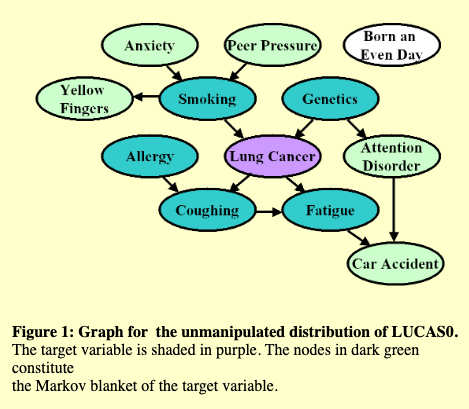
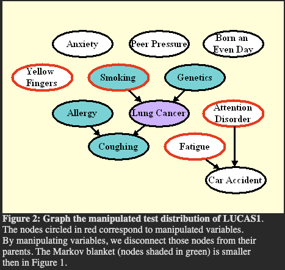
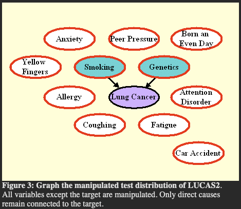

# Grading
- Motivation, description of dataset and causal questions, description of assumptions, show true causal graph or a reasonable guess (10% grade)
- Exploratory Data Analysis, testing correlations/conditional independences (15% grade, follow Tutorial 1&2)
- Identify estimands for backdoor, frontdoor criterion and IVs, if they apply, or explain why they don't apply (20% grade, follow Tutorial 3 and 4)
- Apply different methods to estimated the causal effects (e.g. linear, inverse propensity weighting, two stage linear-regression etc) to the estimands you have previously identified (10% grade, follow Tutorial 4)
- Causal discovery results for at least one constraint-based (e.g. SGS, PC) and score-based algorithm (e.g. GES), explain why it works or it doesn't and what is identifiable (20% grade, follow Tutorials 5 and 6)
- Validation and sensitivity analysis (e.g. refutation analysis in DoWhy), discussion on the assumptions and results (20% grade, follow Tutorial 6)

# Motivational Challenges
[LUCAS Project Link](http://www.causality.inf.ethz.ch/data/LUCAS.html)
## LUCAS0: Medical diagnosis

The Markov blanket (MB) is the set of variables such that the target is independent of all other variables given MB.

The goal of the challenge is not to discover the MB. The goal is to make best predictions of the target variable on test data (evaluated by Tscore). We use the Fscore only as an indicator, not for determining the winner. There may be a correlation between Fscore and Tscore, but this is not guaranteed.

## LUCAS1: Predicting the consequences of actions

As a result of manipulations, many variables may become disconnected from the target and the Markov blanket (MB) may change. If you know which variables have been manipulated (for some datasets we tell you), as long as you have the graph of the unmanipulated distribution  inferred from training data, you can deduce easily which variables to exclude from the set of predictive variables. The Fscore is this time based on the MB of the manipulated distribution.

## LUCAS2: Discovering the direct causes

The graph of Figure 3 shows the model we used to generate the test data in LUCAS2 (same training data as LUCAS0). Here we manipulated all the variables except the target. As a result, only the direct causes of the target are predictive, and coincide with the Markov blanket (MB) of the manipulated distribution. The Fscore is again based on the MB of the manipulated distribution. Note that manipulating all the variables can seldom be done in real experimental setups.